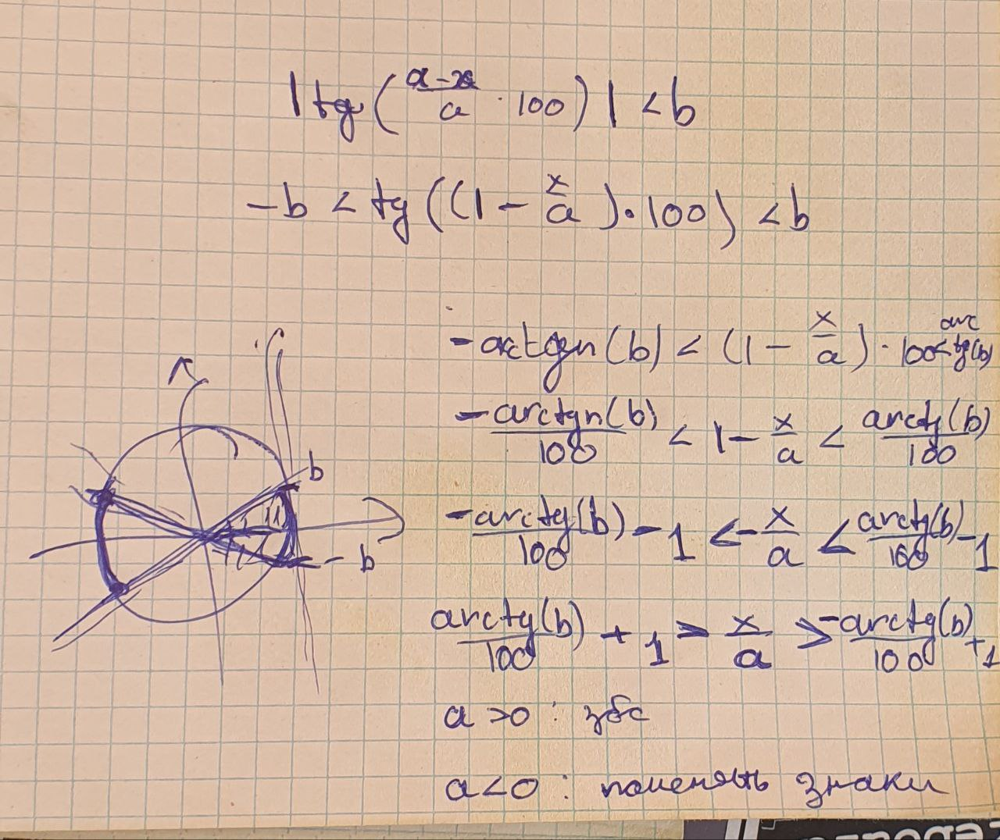

# Уявзимость

### Эскплуатация данного вектора требовала двух уязвимостей.

## Неверно составленный SQL запрос

Для отображения пользователю его лабораторных работ использовался следующий SQL запрос.

```go
	for _, res := range tmp {
		var found []LabResult
		// поиск в коридоре подгрешности с достаточной точностью. См начало файла
		lc.db.Debug().Model(&LabResult{}).Where("error < ? AND abs(expected - ? ) < error", eps, res.Expected).Find(&found)
		result = append(result, found...)
	}
```
Как и указанно в комментарии этот запрос ищет результаты лабораторных работ с погрешностью меньше заданной точности (`0.001` по умолчанию). Однако данный запрос не имеет привязки к конкретному пользователю. 

Учитывая что при создании проверяется, что лабораторная работа со схожим теоретическими **И** практическими данными не присутствует в базе данны игроки получали возможность создать лабораторную работу с тем же теоретическим значением, малой погрешностью и сильно отличным эксперементальным результатом, чтобы захватить исходную лабораторную работу.
```go
// проверка с большим eps для избежания повторений. См начало файла
	if err := lc.db.Where("abs(expected - ?) <= ?  AND abs( test_result - ?) <= ?", expectedResult, searchEps, testResult, searchEps).First(&labResult).Error; err == nil {...}
```

## Периодическая функция расчета погрешности

```go
const measurements = 10
const studentsCoefficient = 100


func (lr *LabResult) calculateMeasurementError(expected, test float64) {
	if expected == 0 {
		expected = test
	}
	probabilityError := math.Pow(0.5, float64(measurements))
	measurementError := math.Tan(math.Abs((expected-test)/expected) * studentsCoefficient) // here

	lr.Error = math.Sqrt(math.Pow(probabilityError, 2) + math.Pow(measurementError, 2))
}
```

В фукнции рассчета погрешности использовалась функция тангенса, являющаяся переодической, что позволяло даже сильно различным теоретическому и эксперементальному значению выдавать малую погрешность.

# Эксплуатация

Фактически необходимо было решить систему вида `|tan((x  - a) / a * 100)| < 0.001 && x > a + 0.1`. Однако в силу большого коэффициента при аргументе тангенса и малой точности автору не удалось найти способ получить численное решение с помощью z3, sympy и sage, поэтому обратимся к тригонометрии за 11 (а у кого-то и 10) класс.



Т.о полученные решения имею периодичность в `2 * pi * n`, что позволяет получить сильно отличное от исходного эксперементальное значение, которое тем не менее будет выдвать малую погрешность.

[Код эксплойта](./math_sploit.py)

[Код решения уравнения](./math_sploit_lib.py)

# Фикс

## Ленивый вариант

ЛЮБОЕ изменение в формуле, которое сохраняло бы работоспособность сервиса и для одинаковых теоретического и эксперементального результата возвращало бы близкое к 0 значение.

## Адекватный вариант

В объявлении структуры пользователя и лабораторной работы уже настроение отношение, поэтому достаточно было использовать предоставленный GORM функционал для подобных запросов.

```go
type LabResult struct {
	gorm.Model
	PublicResults
	TestResult float64 `json:"testResult"`
	Comment    string  `gorm:"size:255;" json:"comment"`
	UserID     uint
}

type User struct {
	gorm.Model
	Username string      `gorm:"size:255;not null;unique" json:"username"`
	Password string      `gorm:"size:255;not null;" json:"-"`
	Labs     []LabResult `gorm:"foreignKey:UserID"`
}
```
```go
    // Пример правильного запроса к базе данных.
	lc.db.Model(user).Association("Labs").Find(&tmp)
```